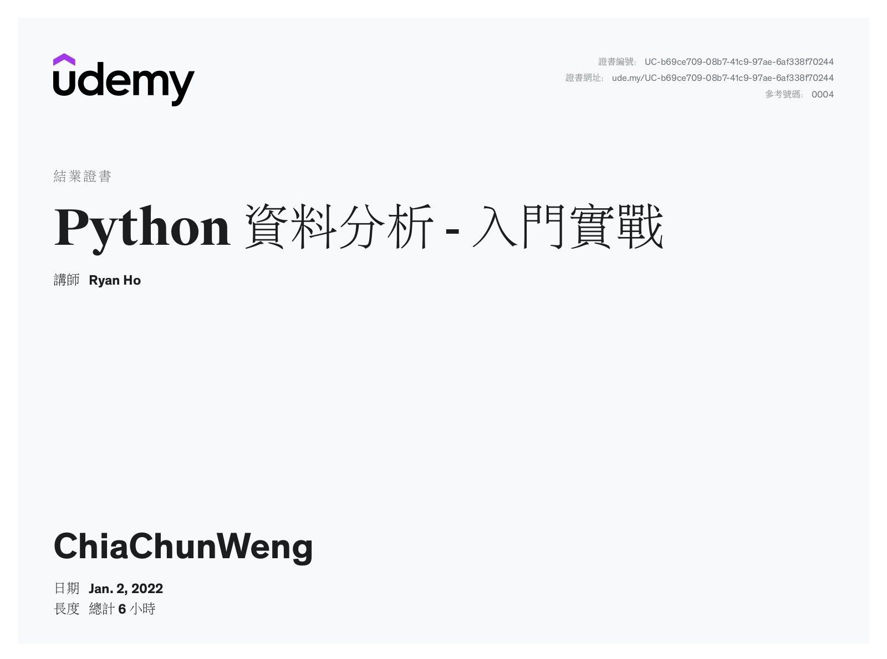

# Udemy Data Analysis 練習
## 課程來源
[Python 資料分析 - 入門實戰](https://www.udemy.com/course/codegym-python-analytics/).

- [ ] 第一堂課 - 課程介紹
- [ ] 第二堂課 - Python環境設置
- [x] [第三堂課](/第三堂課)
- [x] [第四堂課](/第四堂課)
- [x] [第五堂課](/第五堂課)
- [x] [第六堂課](/第六堂課)
- [x] [第七堂課](/第七堂課)
- [x] [第八堂課](/第七堂課)
- [x] [第八堂課](/第八堂課)
- [x] [第九堂課](/第九堂課)
- [x] [第十堂課](/第十堂課)
- [x] [第十一堂課](/第十一堂課)
- [x] [第十二堂課](/第十二堂課)
- [x] [第十三堂課](/第十三堂課)

## 結業證明

